# Basic Setup

- we need 2 directories in the the project, one being the dist folder and the other being the src folder
- dist is the folder which goes into production, like the tailwind code that we've written builds some CSS files accordingly

- command to tailwindconfig.js files => npx tailwindcss init

- the input.css file in src folder has these 3 lines (@tailwind base; @tailwind components; @tailwind utilities;)

- use tailwindIntelliSense for suggestions inline

- changes in tailwindconfig.js file :- So, together, ./dist/\*_/_.{html,js} means "look inside the dist directory and all of its subdirectories for any files with the .html or .js extensions."

- npx tailwindcss -i "path of input.css file in which all three lines are present" -o "path of the directory/name of the output css file in which all the tailwind builds" (qoutes are not expected in the command)

- npx tailwindcss -i ./src/input.css -o ./dist/output.css --watch (the main command)

# Some Basic Classes and some CSS concepts

- rem is a unit to give font size (1rem = 16px) [derived from the root html element of the document and when the user changes the font size from the root element tab the website reacts]
- m-4(1rem, 16px), p-6(1.5rem, 24 px)
- 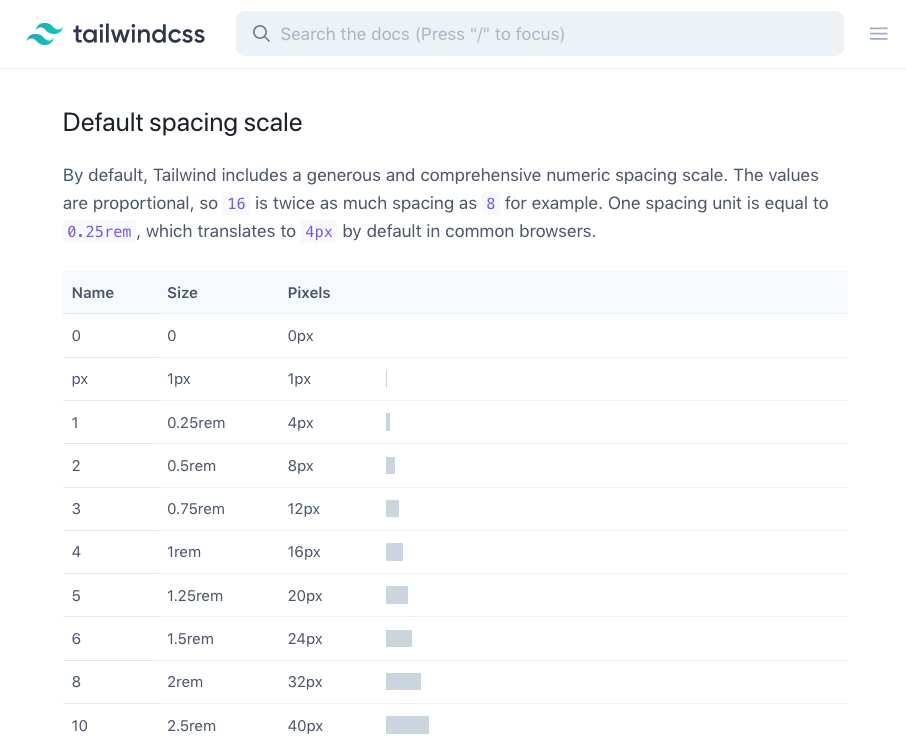 => rem unit scaling, mostly we have to see by trial and error
- mx-auto se horizontal centring, my-auto se vertical centring
- 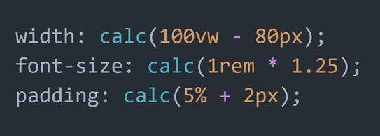 for applying very detailed CSS like 80% viewport height se 5 px kam ho ya 10 px kam ho
- box-sizing: border-box; // ye chije mandatorily karlo in the root selector and then move on to the other code sections
  margin: 0;
  padding: 0;
- my laptop has 1360 x 656 pixels in width and height respectively, so we'll design websites accordingly
- flex col. makes the flex happen in vertical direction
- object-cover to the div of image will crop the image while preserving its aspect ratio, better than overflow hidden for the images having predefined width and height bigger than the container that they're in
- color-pallete banane ke liye use hsl values ek color pakdo (baadme gradient banane ke liye kaam aayega) hue badlo of a chosen color, keep the saturation and lightness fixed to make a color pallete
- max-w-(any value here) will make the component take the max specified width of the container
- agar text ke andar hi kuch specific words pe styling lagani hai to we can use span tag to bring the content inside it
- custom values inside the tailwind likhne ke liye rem units ke multiples use karna is better since again you know vo iPhone ka chakkar
- chote devices pe we can give the display hidden and medium devices pe display block
- we can use multiple cursors in tailwind too so as to give similar styles to many things
- &#8801 is the inside anchor tag to get the hamburger menu icon
- h-auto dete jao and the website adjusts the height of the container according to the content inside it
- fixed px values can cause dikkat when zooming in or out therefore its better to use rem units to make the website responsive 
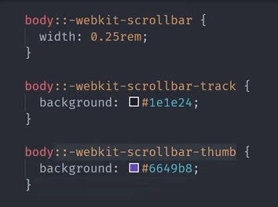 => customizing the scroll bar
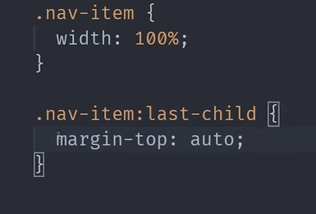 => navbar me items ko spacing dena
 => collapsible effect   

- grayscale(100%) se grayscale(0%) and then opacity(0.7) se opacity(1) on hover, usse modern feel aayega that the shit is lighting up
- letter-spacing: 0.3ch (makes the letters space more), font-weight: bold for logo texts
- we can even do some small transitions like rotate(0degree) to some other value for rotating the svg logo [transitions work for svg logos] 
- rest search in tailwind docs

# Custom values

- we can use arbitary values in tailwindCSS properties using hyphen and [] brackets (but it works for only pixel values first)
- filhaal me clamp is not supported in tailwind, so we can maybe use the clamp in head tag's tailwind
- Also if we want to viewport units to something then using custom utility classes make sense

module.exports = {
theme: {
extend: {
width: {
'clamp-200-50vw-800': 'clamp(200px, 50vw, 800px)',
},
},
},
plugins: [],
};

- this is how we can write custom tailwind values and classess

# Advanced CSS concepts

### grid

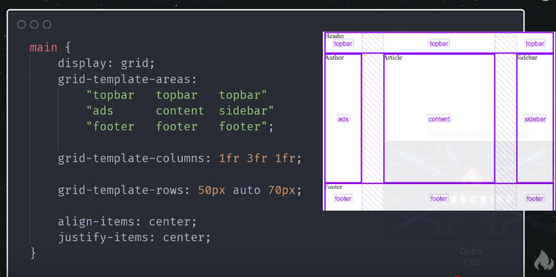
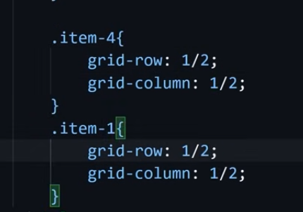 => for placing multiple items one over the other, we use this, applicable on child divs and the lines are named from the border of the grid itself, starts at the border and ends at the border
- place-items center

- grid-auto-rows: minmax(100px, auto); => this property is god since it'll help you to add new rows when you have data after fetching data from the API, auto karke max width kardo and minimum height of the row humne 100px daal diya

### flex

- justify-content brings the content in main axis ka centree, if we make the main axis column then vertically justify content kaam karega
- flex wrap brings the overflowing content in the next line
- try to avoid using gap in flex not in grid, instead space evenly makes more sense
- order property helps you to bring the elements in order, like if we want that some specific element should come earlier in the flex container then we can give that element the order of -1 and then the element comes before the elements which have a positive order value, jaise we give elements the value of flex usi tarah we give those elements value of order to order them properly if we want
- giving values of flex to children makes them take those many number of fractional units just like grid is, like children ki styling me flex: 1; will give it 1 fr

### Responsive design (mobile first approach)

- z-index brings the elements in front making the website look 3D in nature and the elements look one over the other 
- write the CSS for mobile first then use sm:/md:/lg: type psuedo classes for writing the design for larger screens
- image ke size ko manipulate karne ke liye insert the link instead of downloading (if possible)
- clamp(minimum-value preffered-value maximum-value) => we can give this value to any property of CSS to make our components responsive
- video/image ke liye aspect ratio : 16/9 karne se kaam hojaata to maintain the aspect in responsive websites

### psuedo classes

- focus-within psuedo-class to make the list still holding the custom CSS even after clicking something inside the list sub-items
- focus class is used to style elements jab unpe focus aaye tab karke ya fir click karke
- active class is used to style elements jab unpe click ka moment ho raha hota hai yaani when the person is holding the stuff jispe active class laga rahe hai
- dark: psuedo class helps you to write seperate styling for dark mode if we want to change something then

# Param CSS tricks to make something like piyush garg

- use header tag + nav tag for SEO based response

- CSS only navigation tutorial from Coding2GO channel for mobile based navbar which collapses

- rem use karna is better for giving anything kyuki, iphone madarchod waale apna custom root font-size rakhte hai

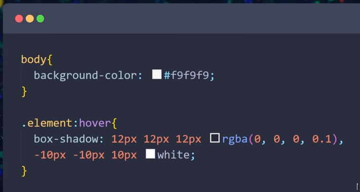 => make sure to do the white color lighter than the element's background (slightly lighter)

- give the child element the background color rgba(255,255,255,0.05) and then give backdrop-filer: blur(10px), more the pixels more the blurness, use borders shadows to make it more realistic

- dark mode ke liye seperate color and stuff, ask her about the color that she want in every element and so

- 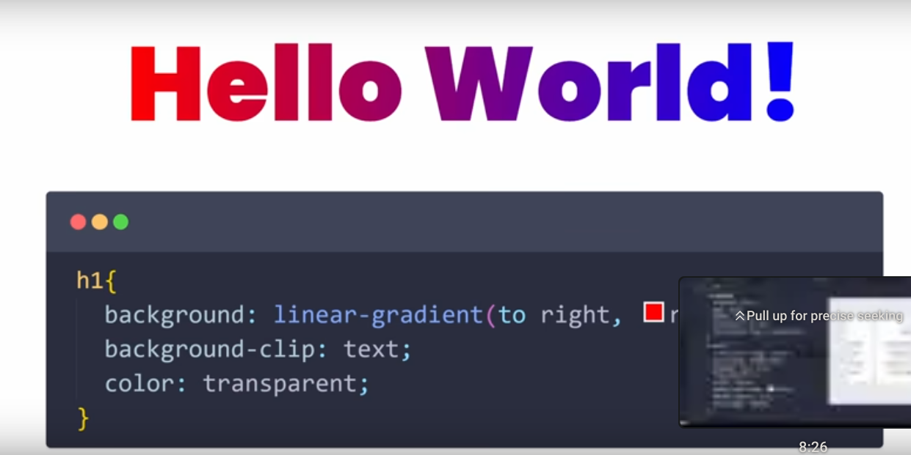 => text ko gradient color dene ke liye

- select tag for getting a dropdown menu, and option tags inside it for giving the name to the options

- for bringing checkbox, we input of type checkbox then label tag inside it with the name of the checkbox

- gradient card border laa do from the aceternity, jispe man kiya usme meteors ka card, flip words animation from aceternity ui, floating navbar bana liya, infinite scrolling cards, lamp effect in home page, lamp effect ke saath text generate effect, sroll-bar ke badle we can bring the line jo aise falling light ki tarah ho

- waves video (https://www.youtube.com/watch?v=lPJVi797Uy0)

- 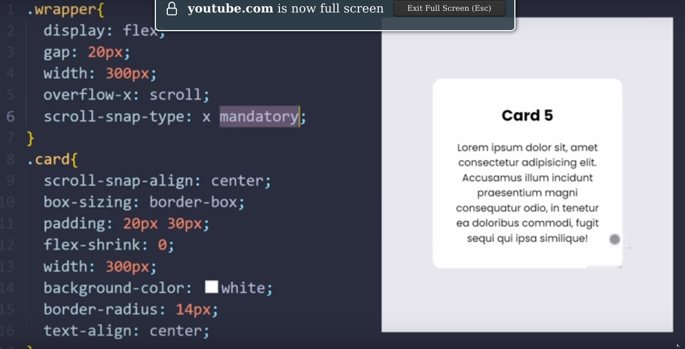=> this is how to bring the slider for different cards, isko automatic kar denge using js or something else

- 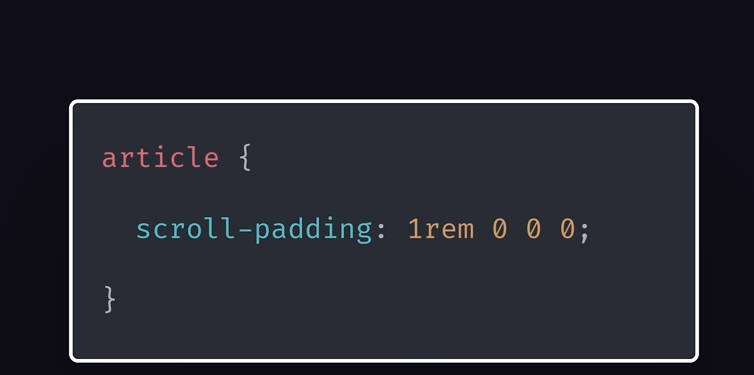=> isse ek specific portion of the page pe aane ke baad apne ko fixed navbar ke wajah se uss portion of the website ka heading nahi chupega

- 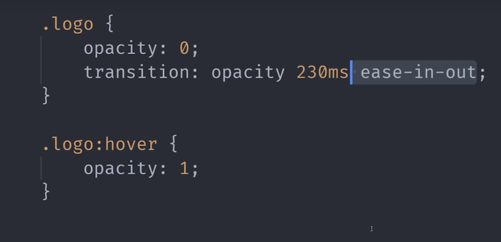=> CSS animation for rendering the content in the website

- 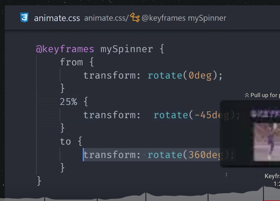=> for some infinite animation in the website
- 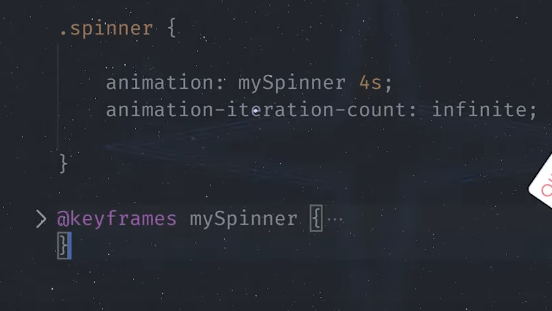=> part2 of the same

- remember to manipulate the purge property in the tailwind config file to remove unused CSS

- transition property doesn't works with the height-auto properly since browser needs fixed values to create animation effects and thus it creates the delays accordingly 

- therefore try to use max-height property since by fixing a height value will make it unpredictable ki what will the height of something, height of something nahi pata tabhi to usko auto set kiya hai 

- max-height auto ka bhi feature de rha hai and simultaneously apne ko fixed values of height ka bhi faayda de rha hai 

- freeFrontEnd and devUI + mantime
